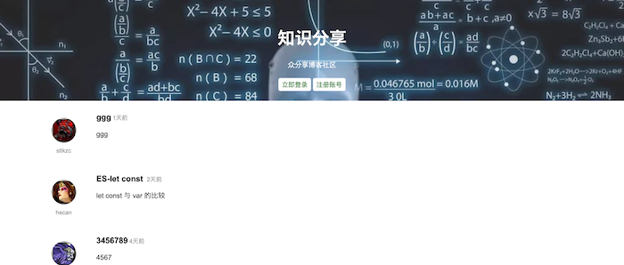
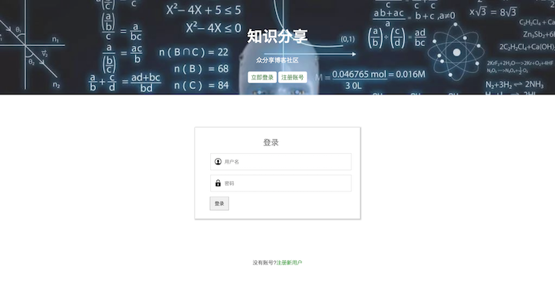
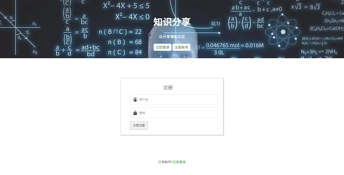
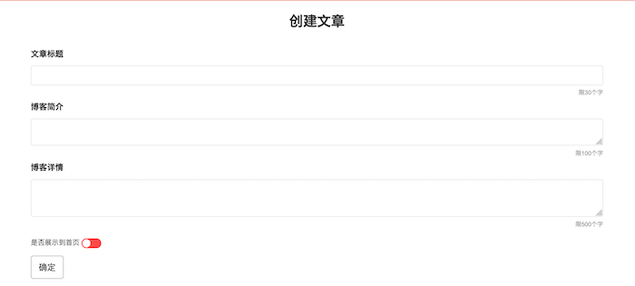
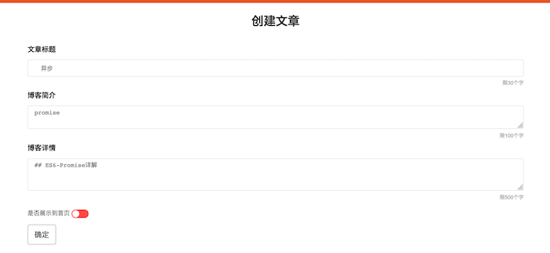

### blog share platform(博客轻分享平台)
使用Vue框架，搭建一个博客分享平台。
主要功能： 
- 展示所有的博客列表
- 登录、注册
- 创建新的博客
- 展示博客详情
- 修改、删除博客
- 注销账号
### 技术栈
JavaScript，*ES6 promise 赋值结构**，**Vue**,**Vuex**,**Vue-router**, **elementUI**，**axios**, HTML5，CSS3 响应式 **flex**

难点：
### 总结
1. 对项目文档结构的合理有进一步的了解

2. 第一次 使用promise，promise为异步操作，带来很多遍历

3. Vue-router 对项目的路由进性管理。对动态路由、路由传参、路由的编程式导航、路由重定向、守卫导航等路由知识有了进一步掌握。

4. 用Vuex，对用各个组件都需要用到的**用户信息**进行管理，对 vuex的核心知识点**state**、**getters**、**mutation**、**action**、**Module**，有了更细致的了解。

### 效果图
首页

****
登录、注册

****
创建、修改博客

